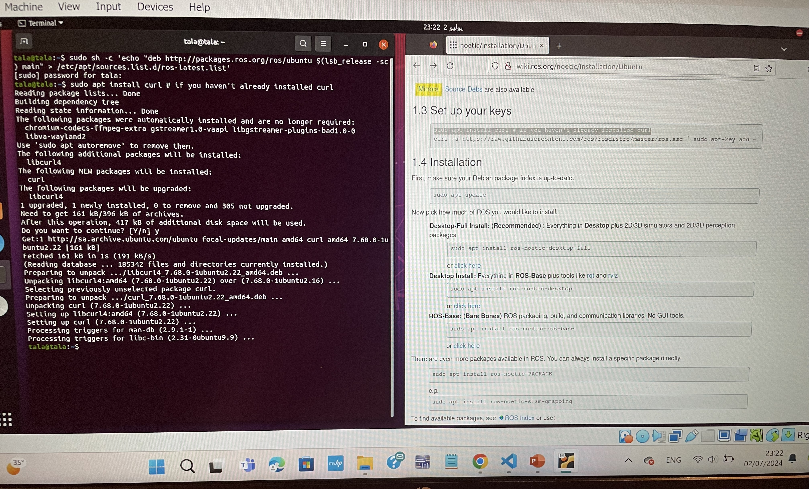
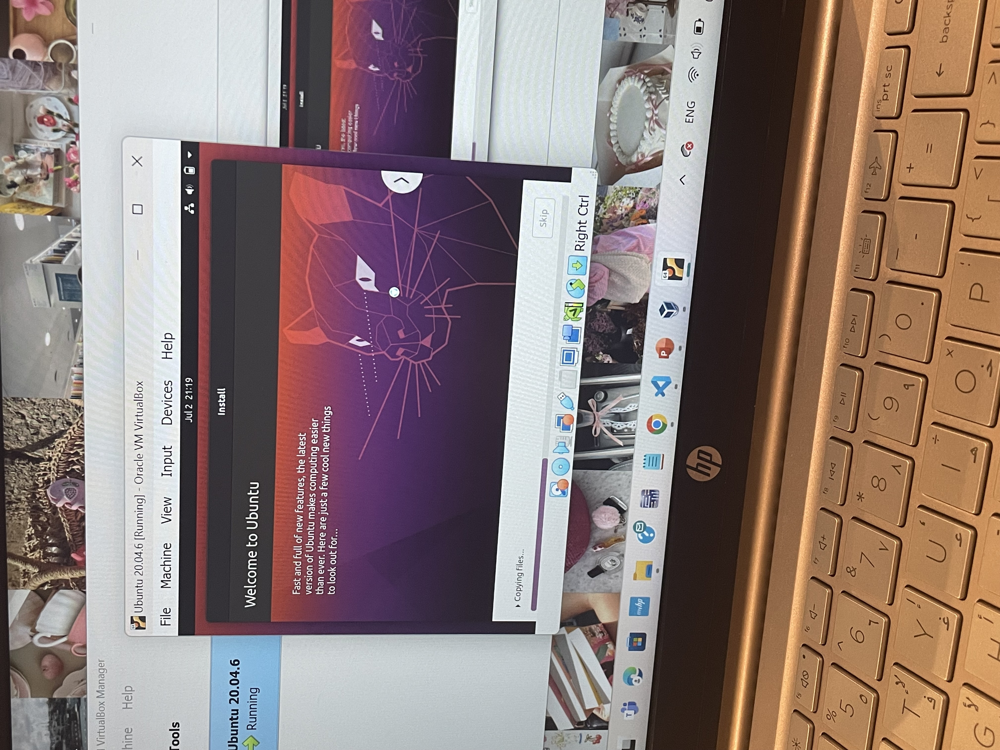
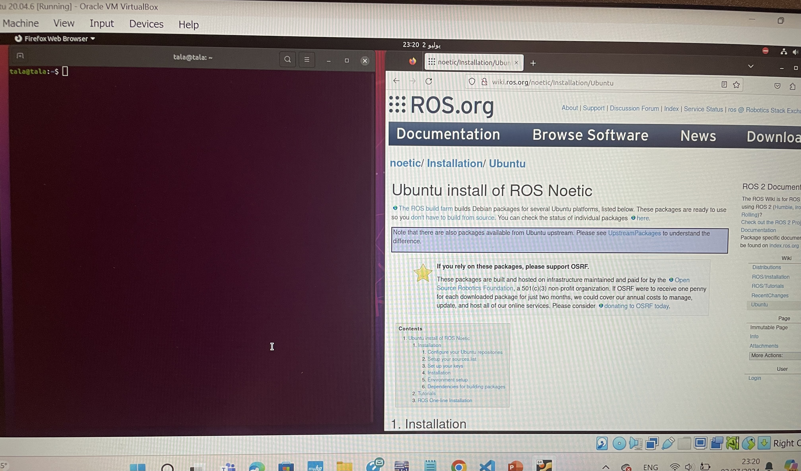
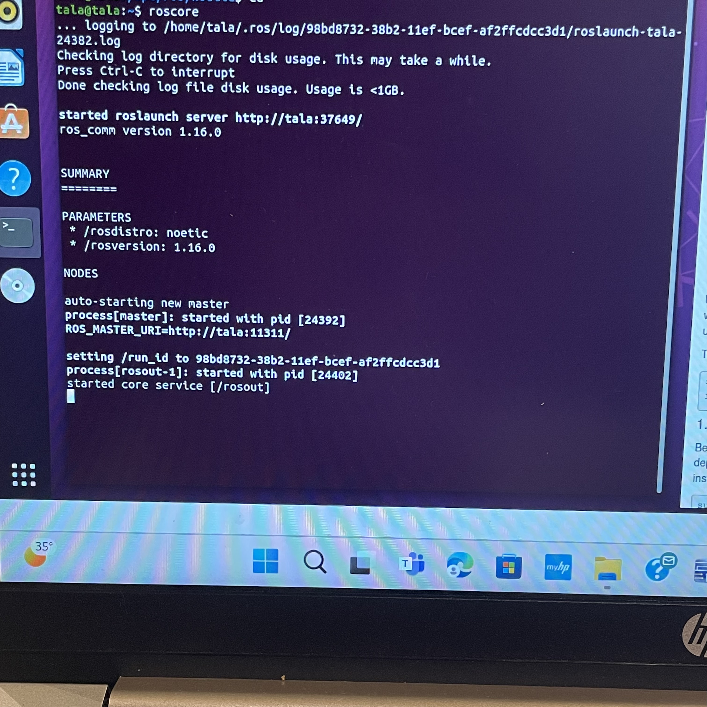

# ROS Noetic Installation steps

### 1. Install VirtualBox
1. Download VirtualBox from the link (https://www.virtualbox.org/wiki/Downloads).
2. Follow the installation instructions on the VirtualBox website.

### 2. Set Up Ubuntu 20.04.6 on VirtualBox
1. Download the Ubuntu 20.04.6 ISO file (https://releases.ubuntu.com/20.04/).
2. Open VirtualBox and create a new virtual machine.
3. Follow the VirtualBox prompts to set up the VM and use the downloaded ISO file as the boot image.
4. Install Ubuntu on the virtual machine.



### 3. Install ROS Noetic
1. Open the terminal in Ubuntu.



2. Add the ROS Noetic repository:
    ```bash
    sudo sh -c 'echo "deb http://packages.ros.org/ros/ubuntu $(lsb_release -sc) main" > /etc/apt/sources.list.d/ros-latest.list'
    ```
3. Set up your keys:
    ```bash
    sudo apt install curl
    curl -s https://raw.githubusercontent.com/ros/rosdistro/master/ros.asc | sudo apt-key add -
    ```

 

4. Update your package index:
    ```bash
    sudo apt update
    ```
5. Install ROS Noetic:
    ```bash
    sudo apt install ros-noetic-desktop-full
    ```
6. Initialize rosdep:
    ```bash
    sudo rosdep init
    rosdep update
    ```
7. Set up your environment:
    ```bash
    echo "source /opt/ros/noetic/setup.bash" >> ~/.bashrc
    source ~/.bashrc
    ```
8. Install dependencies for building packages:
    ```bash
    sudo apt install python3-rosinstall python3-rosinstall-generator python3-wstool build-essential
    ```

## Verification
Run the following command to verify the installation:
```bash
roscore
```


