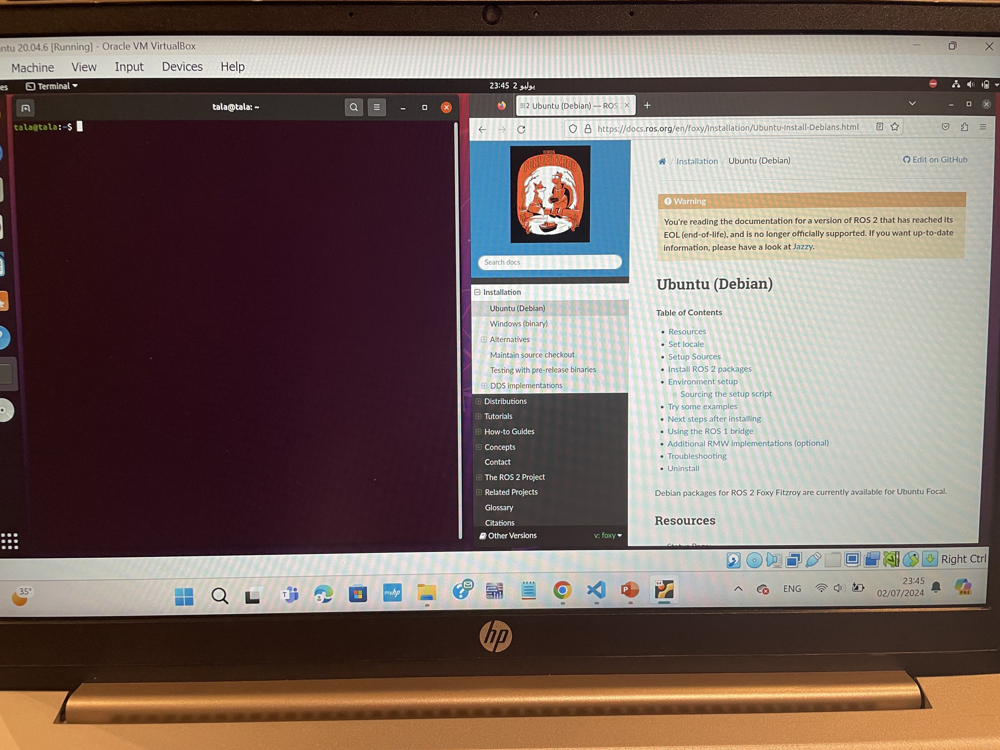
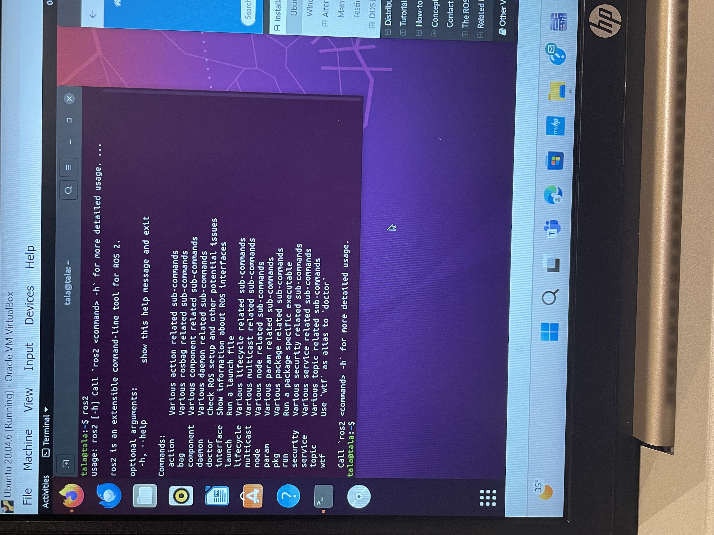

### ROS2 Foxy Installation steps

### In installing Ros Noetic, we worked on all the previous steps to reach this point

### 1. Install ROS2 Foxy
1. Open the terminal in Ubuntu.



2. Set up your sources.list:
    ```bash
    sudo apt update && sudo apt install curl gnupg2 lsb-release
    curl -sSL http://repo.ros2.org/repos.key | sudo apt-key add -
    sudo sh -c 'echo "deb [arch=amd64,arm64,armhf] http://repo.ros2.org/ubuntu/main $(lsb_release -cs) main" > /etc/apt/sources.list.d/ros2-latest.list'
    ```
3. Update your package index:
    ```bash
    sudo apt update
    ```
4. Install ROS2 Foxy:
    ```bash
    sudo apt install ros-foxy-desktop
    ```


5. Source the setup script:
    ```bash
    source /opt/ros/foxy/setup.bash
    ```
6. Install dependencies for building packages:
    ```bash
    sudo apt install python3-colcon-common-extensions
    ```

## Verification
Run the following command to verify the installation:
```bash
ros2 run demo_nodes_cpp talker
```


